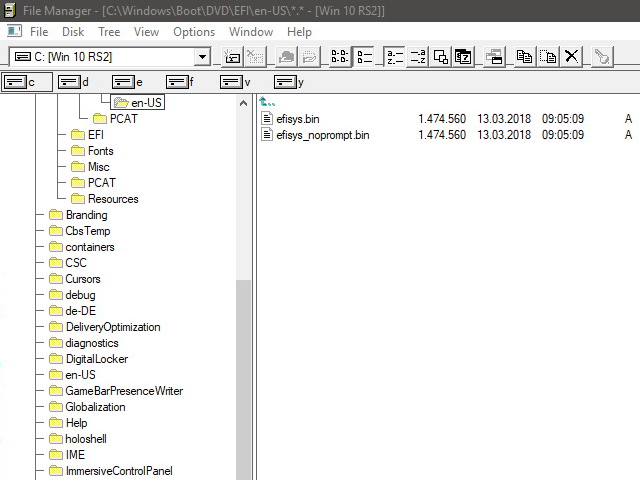

# 黑板报：第 1 期（20200406）

黑板报：第 1 期（20200406）

\#技术\# 

整天戴着外科口罩会给耳朵带来不适。奎因·罗尼（Quinn Roney）和他的妈妈希瑟（Heather）做了个3D打印的“护耳器”，用于固定外科口罩的弹性带，以减轻耳朵上的压力。

该设计已由NIH（美国国立卫生研究院）审查并批准用于临床。一个星期内，他亲自制作了1300多个，提供给温哥华的几家医院。

3D模型文件下载：

[https://www.thingiverse.com/thing:4249113](https://www.thingiverse.com/thing:4249113)

\#疫情\# 

苹果设计的面罩。

用透明的塑料面板覆盖整个面部，每盒100个，两分钟内组装完毕，并且完全可调。

[https://twitter.com/tim\_cook/status/1246916489589837824](https://twitter.com/tim_cook/status/1246916489589837824)

\#疫情\# 

布朗克斯动物园（Bronx Zoo）的四岁雌性马来虎已被冠状病毒检测为阳性。

来源：[https://www.bbc.com/news/world-us-canada-52177586](https://www.bbc.com/news/world-us-canada-52177586)

照片：[https://www.instagram.com/p/B2PFsVFpRDh/?utm\_source=ig\_embed](https://www.instagram.com/p/B2PFsVFpRDh/?utm_source=ig_embed)

\#技术\# 

DeepL 翻译，最新集成了中文和日文，利用神经网络训练翻译能力，与Google或Bing翻译相比，结果更自然。

[https://www.deepl.com/translator](https://www.deepl.com/translator)

\#技术\# 

Windows文件管理器（WinFile），最初是在1990年代初与Windows 3.0一起发布的。

如今已开源，并支持Windows 10版本。

[https://github.com/microsoft/winfile](https://github.com/microsoft/winfile)

\#教育\# 

斯坦福大学计算机科学系正在举办名为“就地编码（codeinplace）”的编程课。它作为Python入门，使用斯坦福大学CS106A课程的上半年内容。

课程不是MOOC，通过视频会议上课，要求18岁以上的学生，课程日期：4月13日至5月22日。

[https://compedu.stanford.edu/codeinplace/announcement/](https://compedu.stanford.edu/codeinplace/announcement/)

\#派森社\#

吕启刚：小学人工智能课程的开发与实施初探

[https://mp.weixin.qq.com/s/pzp7v8TUMfLn0xpxlssFrA](https://mp.weixin.qq.com/s/pzp7v8TUMfLn0xpxlssFrA)

