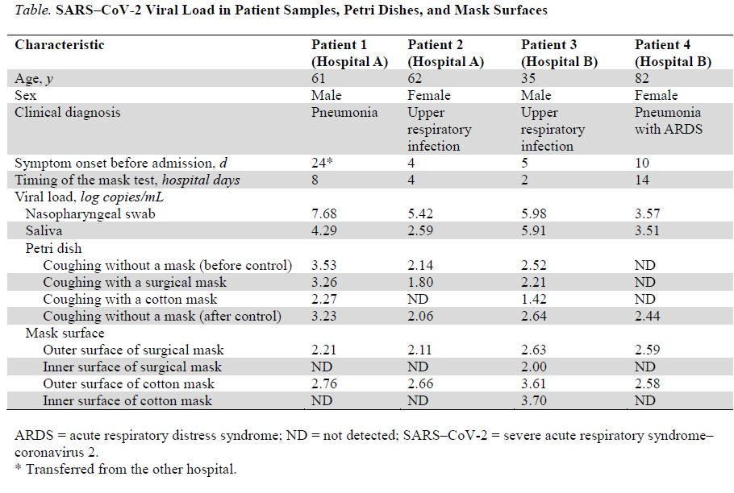
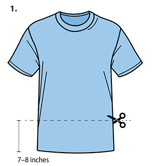
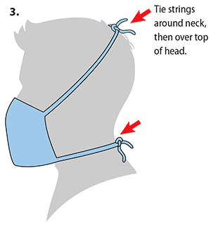
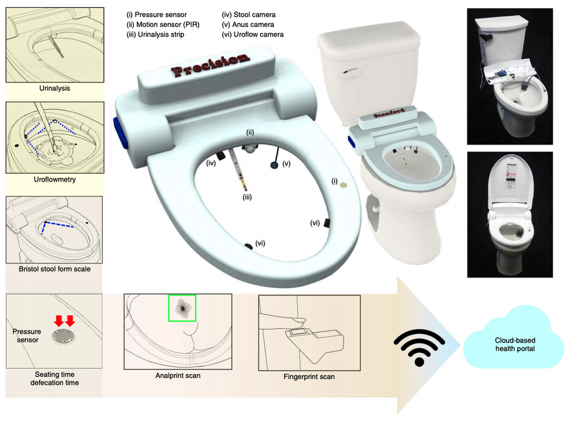
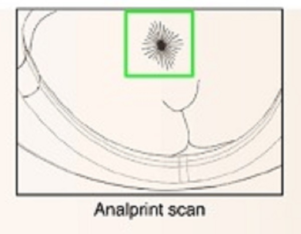
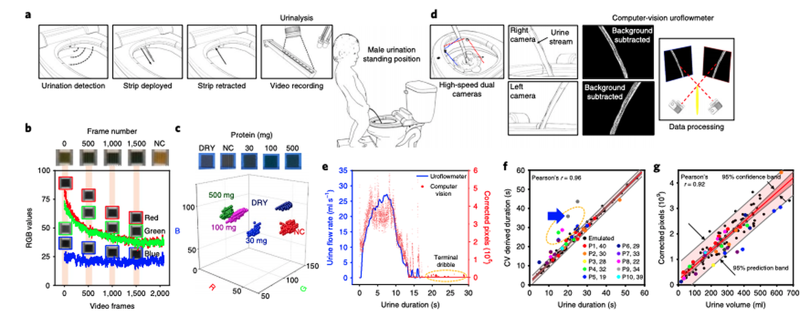
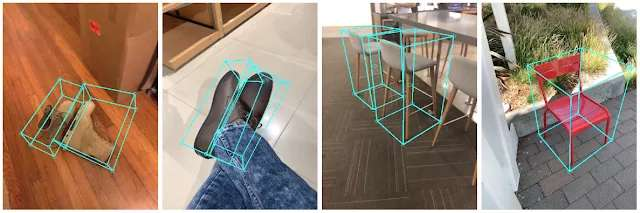
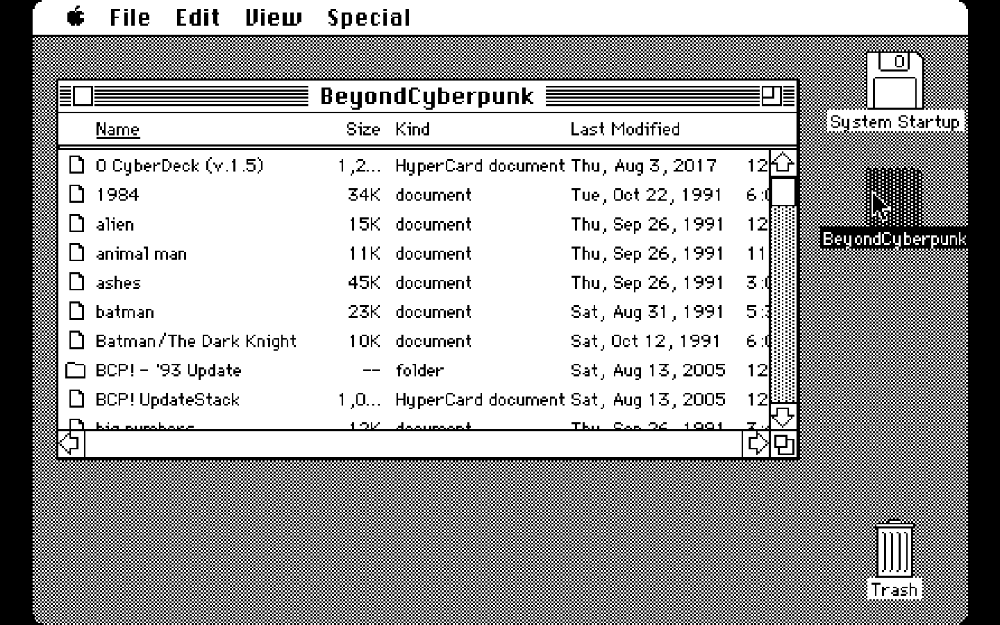
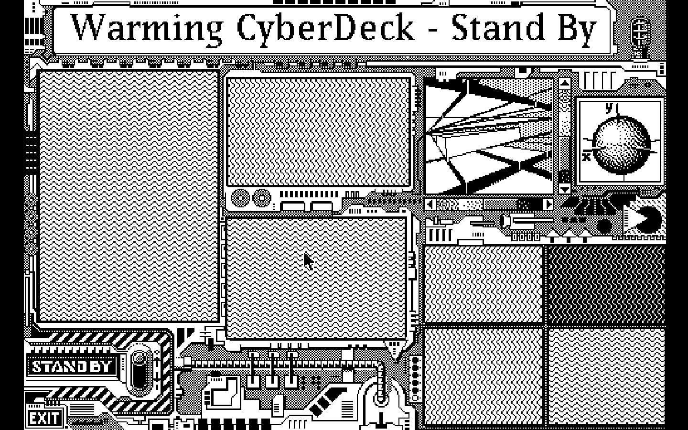
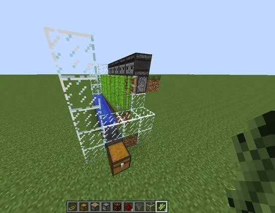

# 黑板报：第 2 期（20200407）

黑板报：第 2 期（20200407）

**「疫情」**

美国内科医学院新的研究表明，在感染患者的咳嗽期间，无论是外科口罩还是棉口罩都不能有效过滤SARS–CoV-2。0.04至0.2μm的颗粒可以穿透外科口罩。该实验未包括N95口罩。

[https://annals.org/aim/fullarticle/2764367/effectiveness-surgical-cotton-masks-blocking-sars-cov-2-controlled-comparison](https://annals.org/aim/fullarticle/2764367/effectiveness-surgical-cotton-masks-blocking-sars-cov-2-controlled-comparison)

【CDC发布自制布口罩指南】

由家用物品制成或由普通材料制成的家用廉价布面覆盖物，可用作额外的自愿性公共卫生措施。

PDF版本：[https://www.cdc.gov/coronavirus/2019-ncov/downloads/DIY-cloth-face-covering-instructions.pdf](https://www.cdc.gov/coronavirus/2019-ncov/downloads/DIY-cloth-face-covering-instructions.pdf)

**「技术」**

【智能马桶系统，可通过排泄物分析进行个性化健康监测】

该系统可以跟踪特定个人随时间的排便和排尿情况，它配有将近 12 个传感器，可以执行现场标本检查（检查粪便和尿液中的稠度，颜色，葡萄糖和红血球计数等）的所有操作，并配备了 4 个摄像头：大便摄像头，肛门摄像头和两个尿流摄像头。

神秘的 analprinting 传感器，安装了扫描仪以记录用户肛门的简短视频片段，并使用了图像识别算法。

发明人斯坦福大学医学院高级研究科学家朴承敏博士在博客文章中写道：“使用人类肛门作为生物特征识别符的潜力并不是一个新概念。” 著名画家萨尔瓦多·达利（SalvadorDalí，1904-1989年）已经发现肛门有35或37个折痕，与指纹一样独特。

绝大多数人担心的是厕所系统中的隐私保护和数据安全法规。接受率最高的模块是尿液分析，而最不受欢迎的模块是analprinting。

论文地址：[https://www.nature.com/articles/s41551-020-0534-9](https://www.nature.com/articles/s41551-020-0534-9)

【实时 3D 对象检测】

Google 推出 MediaPipe Objectron，一种用于日常对象的移动端实时 3D 对象检测。Objectron 源于开源跨平台框架 MediaPipe，该框架用以构建流水线以处理不同模态的感知数据，因此 Objectron 可以在移动设备上实时计算物体的方向 3D 边界框。

[https://mp.weixin.qq.com/s/NZyx2Ra7HXxx1Iw4Yg9hsw](https://mp.weixin.qq.com/s/NZyx2Ra7HXxx1Iw4Yg9hsw)

**「教育」**

【超越赛博朋克】

超越赛博朋克：自己动手做未来指南（1991年），五张软盘 

当我们开始超越赛博朋克（BCP）时，还没有万维网。像苹果公司的HyperCard这样的超媒体程序是廉价地提供带有链接的声音，图像和超链接的超文本的唯一方法。

要求：

Mac Plus或更高版本

5.5MB硬盘空间

1.5MB RAM

HyperCard 2.0

体验模拟器地址：[https://archive.org/details/BeyondCyberpunkMacintosh](https://archive.org/details/BeyondCyberpunkMacintosh)

【红石电子学】

红石是Minecraft 我的世界游戏中的一种特殊的“元件”，通过对这种元件的学习，有助于使学生对电子学产生浓厚的兴趣，顺便还可以掌握大量电子电路方面的知识。

少年创学院院长程晨老师是《红石电子学》一书的作者，上节课我们一起跟程老师学习了基本的红石元件知识， 本节课将涉及更深入的逻辑与或非的相关知识，玩起来就可能意思啦。下面就跟程老师一起继续探究这种神秘的石头吧？

[https://mp.weixin.qq.com/s/11hU0oAfo4NddEycvp4iew](https://mp.weixin.qq.com/s/11hU0oAfo4NddEycvp4iew)

[https://mp.weixin.qq.com/s/bURHhrcorqHtUpfl7sidhg](https://mp.weixin.qq.com/s/bURHhrcorqHtUpfl7sidhg)

